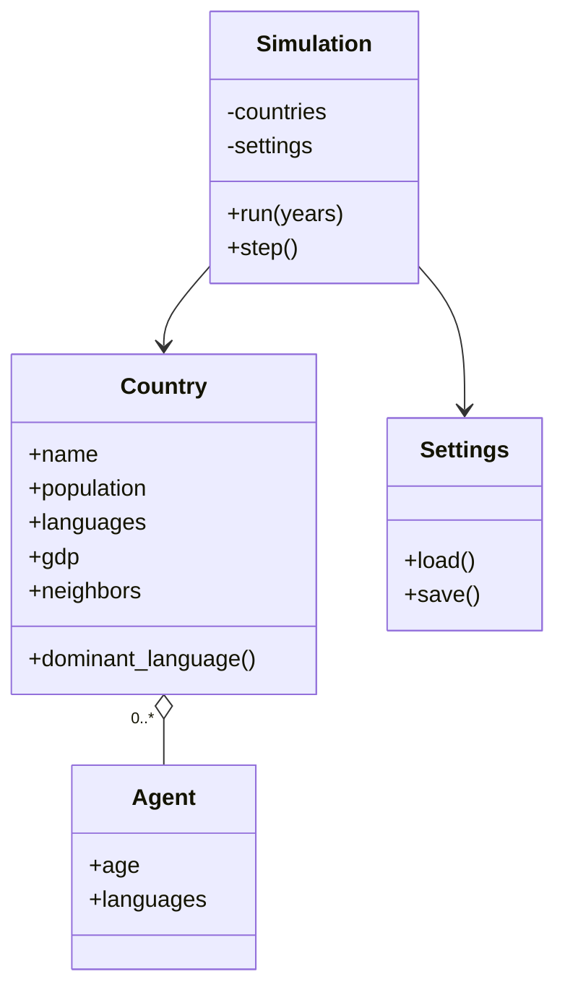

# 8bSim

8bSim is a discrete-time world simulation of population, economy, and language dynamics across multiple countries. Agents are born, age, migrate, learn/forget languages, and new policies shape the landscape. Countries pursue dominance via soft power and, rarely, conquest under strict conditions.

## Highlights

- Infection-style language diffusion with logistic adoption, local/neighbor/global influence, and attrition
- Realistic macroeconomy (Cobb–Douglas with capital accumulation, TFP growth, shocks, and spillovers)
- Migration waves and GDP/language-driven destination choice with overwrite effects during large influxes
- Geopolitics that biases language, migration, and economic spillovers (plus sanctions drag)
- Country AI: per-year choices with cautious conquest (shared-language and power thresholds) and soft policy pushes
- World Settings pages (Economy, Population, Language, Migration, Geopolitics) with persistence
- Modern Streamlit UI with a world map showing dominant language prevalence and rich tooltips

## Quickstart

1) Install dependencies

```bash
pip install -r requirements.txt
```

2) Run the interactive app

```bash
python -m streamlit run app.py
```

3) (Optional) Run a headless sample

```bash
python -m simulation.main
```

## How to run

The commands below are for Windows PowerShell.

1) Create and activate a virtual environment (recommended)

```powershell
python -m venv .venv
.\.venv\Scripts\Activate.ps1
```

2) Install dependencies

```powershell
pip install -r requirements.txt
```

3) Start the interactive app

```powershell
python -m streamlit run app.py
```

- Open the app in your browser at http://localhost:8501
- Stop the app with Ctrl+C in the terminal

4) Run headless in the terminal

```powershell
python -m simulation.main
```

- This sample run executes 20 years with scale_factor=1000 (see `simulation/main.py`) and prints stats to the console.

5) Reset settings to defaults

- Close the app, then delete `simulation/settings.json` (it will be recreated from defaults on next run), or use the UI’s reset if provided.

6) Deactivate the virtual environment (optional)

```powershell
deactivate
```

## UI guide

- World Map
    - Colors = dominant language prevalence (%). Hover for:
        - Dominant language and share
        - Top languages list
        - Population (scaled)
        - GDP per capita proxy
- Live progress shows yearly metrics and per-country charts (Population, Languages, Economy)
- World Settings pages let you tune parameters and persist them between runs
    - Geopolitics page: enable/disable, relation weights, sanctions, migration caps, and custom relation overrides

## Structure

- simulation/config.json — world blueprint (countries, neighbors, initial languages, populations)
- simulation/simulation_models.py — Language, Agent, Country models
- simulation/main.py — config loader and headless runner
- simulation/simulation.py — core engine (demographics, economy, language, migration, AI, geopolitics)
- simulation/settings.py — defaults + persistent settings (JSON)
- pages/World Settings.py — settings UI (economy, language, migration, population)
- pages/World Geopolitics.py — relations editor and geopolitics knobs
- app.py — Streamlit app (live run + charts + final map)

## Architecture (overview)

```mermaid
flowchart TD
    A[Start year t] --> B[Load settings from settings.json and UI]
    B --> C[Demographics: births, aging, mortality]
    C --> D[Economy: Cobb–Douglas, capital accumulation, TFP growth, shocks, spillovers]
    D --> E[Language: diffusion (logistic), local/neighbor/global influence, attrition]
    E --> F[Migration: flows by GDP/language fit; overwrite effects for large influx]
    F --> G[Geopolitics & AI: relations, sanctions drag, cautious conquest rules]
    G --> H[Update country state + collect metrics]
    H --> I{More years?}
    I -- Yes --> A
    I -- No --> J[Render final map + charts]
```

### Core model relationships



## AI and conquest rules (overview)

- Each country can make a small number of choices per year
- Conquest only when:
    - Shared dominant language or a language with significant prevalence in both countries
    - Attacker power ratio >= threshold, and deterrence heuristic passes
    - By default neighbors-only
- After a conquest, the attacker becomes a threat to others (relations reduced), discouraging rapid follow-ups

## Notes

- The simulation loads settings at each step, so UI changes apply without restarts
- For large scale_factor runs, performance depends on your machine; reduce years, disable geopolitics, or lower migration intensity to speed up

## Performance tips

- Prefer headless mode (python -m simulation.main) for long runs; it avoids UI overhead.
- Keep years modest when scale_factor is high; the model is O(years × countries).
- Geopolitics adds extra checks per pair of countries; disabling it can improve runtime.
- If the browser becomes sluggish, close extra Streamlit tabs or lower the update frequency in the sidebar.

## License

See LICENSE